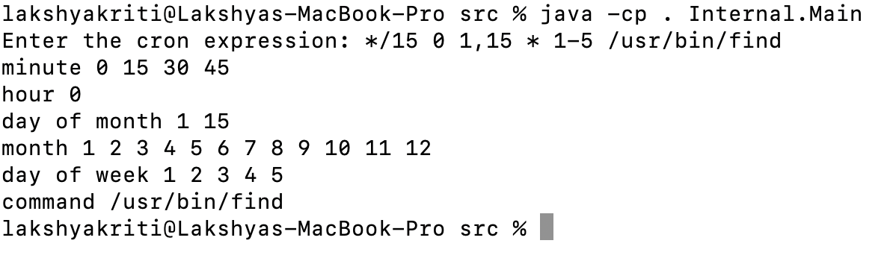

# Cron Expression Parser

This is a command line application or script which parses a cron string and expands each field
to show the times at which it will run. It considers only the standard cron format with five time fields (minute, hour, day of month, month, and day of week) plus a command, and it does not handle the special time strings such as "@yearly". The input will be on a single line.

# Set up and Execution

- cd into src ``cd src``

- Compile the java files ``javac Internal/*.java CronFields/*.java -d .``

- Run the application ``java -cp . Internal.Main``

- To recompile the file again ``rm -rf Internal/*.class CronFields/*.class`` and then Step 2

# I/O Format

